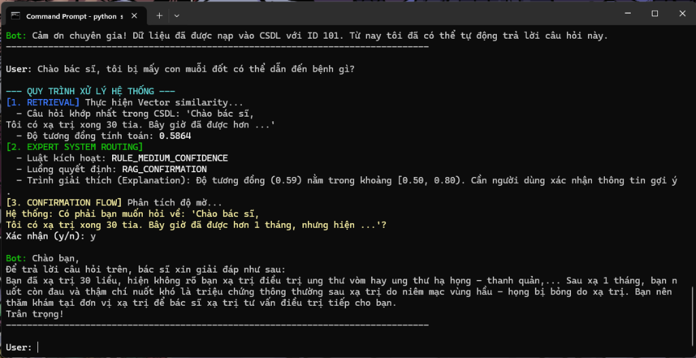
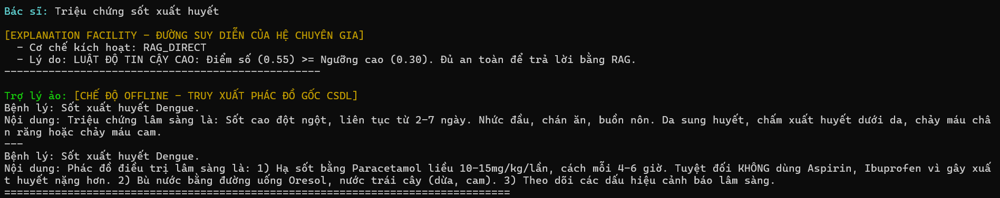
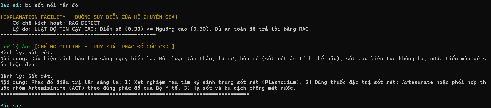
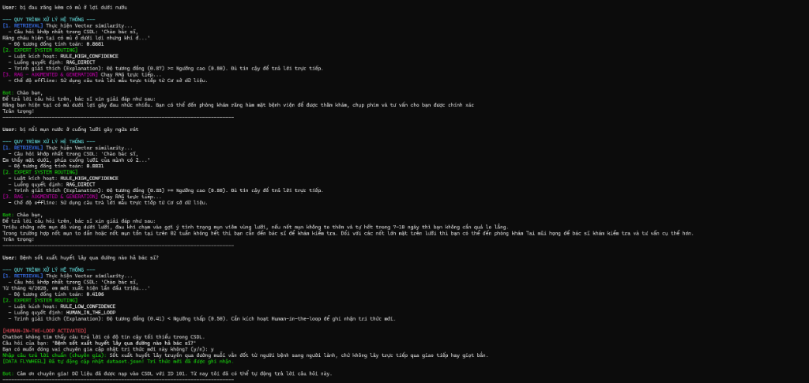
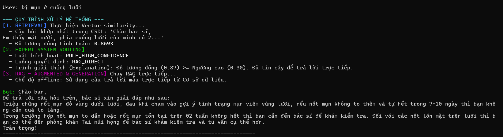
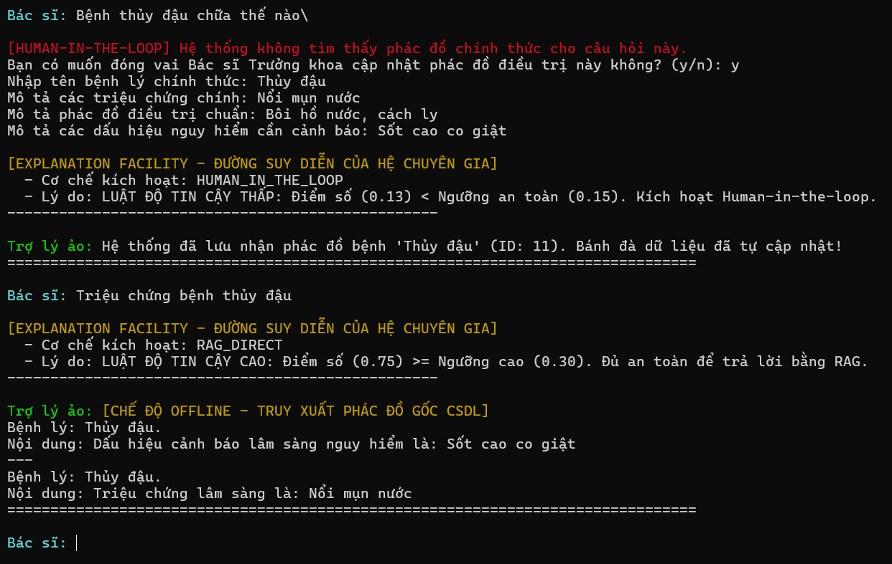
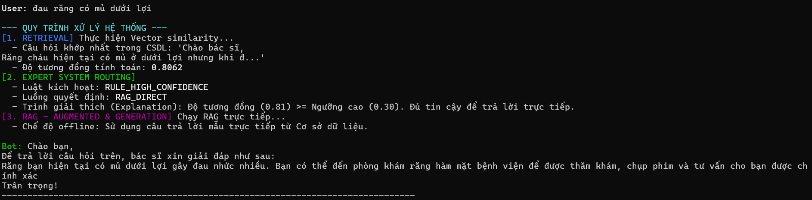
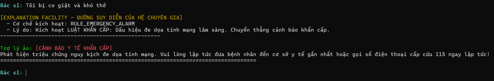
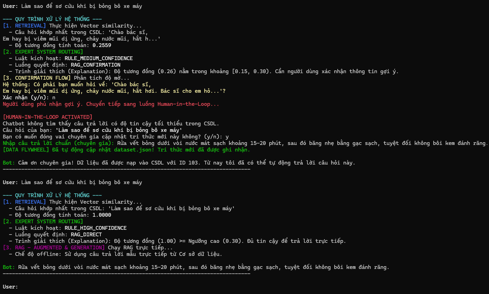

# Hệ thống Trợ lý Hỏi đáp & Kiểm duyệt Phác đồ Điều trị Y khoa (Medical RAG Assistant)

Dự án này xây dựng một hệ thống chatbot thông minh hỗ trợ các bác sĩ lâm sàng hỏi đáp nhanh về phác đồ điều trị y khoa. 

Hệ thống kết hợp ba trụ cột lý thuyết cốt lõi trong phòng nghiên cứu AI:
1.  **RAG (Retrieval-Augmented Generation)**: Truy xuất các tài liệu phác đồ liên quan từ cơ sở dữ liệu vector để làm ngữ cảnh đầu vào cho mô hình LLM (Gemini), giúp câu trả lời tuyệt đối chính xác và loại bỏ ảo tưởng lâm sàng.
2.  **Hệ chuyên gia (Expert System)**: Đóng vai trò lớp kiểm duyệt an toàn (Safety Guardrail) thông qua các luật logic để định tuyến câu hỏi (nhận diện trường hợp khẩn cấp cấp cứu, phân luồng theo độ tin cậy của kết quả so khớp).
3.  **Vòng lặp tự học & Can thiệp con người (Human-in-the-Loop & Data Flywheel)**: Cho phép Bác sĩ Trưởng khoa trực tiếp duyệt và bổ sung phác đồ điều trị mới cho các câu hỏi lạ, hệ thống sẽ tự động cập nhật cơ sở dữ liệu và nạp trực tiếp vector vào CSDL mà không cần khởi động lại.

---

## 🏗️ 1. Cấu trúc Dự án (Project Structure)

Mã nguồn dự án được tổ chức phân lớp rõ ràng theo đúng chuẩn kiến trúc modular:

```text
rag_project/
├── .env                       # Lưu khóa bí mật API Gemini (không đẩy lên git)
├── .gitignore                 # Bỏ qua tệp tin rác, virtualenv và database khi git push
├── config.yaml                # Cấu hình tham số chunking, mô hình LLM và đường dẫn log
├── requirements.txt           # Danh sách các thư viện Python cần cài đặt
├── main.py                    # Bộ điều phối trung tâm (Orchestrator) chạy ứng dụng CLI
│
├── config/
│   └── expert_rules.json       # Tập luật của hệ chuyên gia (từ khóa cấp cứu, các ngưỡng điểm số)
│
├── data/
│   ├── dataset.json            # Cơ sở dữ liệu phác đồ lâm sàng gốc (JSON)
│   └── chroma_db/              # Thư mục lưu trữ tệp cơ sở dữ liệu vector của ChromaDB
│
├── reports/
│   ├── report_0.md            # Báo cáo học tập dự án chi tiết (vòng đời dữ liệu, thuật toán...)
│   └── images/                # Nơi lưu trữ hình ảnh chạy thử (screenshots) làm bằng chứng demo
│       ├── demo_1.png
│       ├── demo_2.png
│       ├── demo_3.png
│       └── demo_4.png
│
├── src/                       # Thư mục chứa mã nguồn chính của các module
│   ├── __init__.py
│   ├── ingestion/             # Load dữ liệu lâm sàng thô và chuẩn hóa tiếng Việt
│   ├── chunking/              # Chia nhỏ tài liệu thành các khối thông tin kèm metadata
│   ├── embeddings/            # Chuyển đổi văn bản thành vector (Gemini API hoặc Hashing Offline)
│   ├── vectordb/              # Tương tác với CSDL Vector ChromaDB (HNSW Cosine Space)
│   ├── retrieval/             # Tìm kiếm, xếp hạng và gộp ngữ cảnh tương đồng nhất
│   ├── llm/                   # Quản lý kết nối và phiên làm việc với Google Gemini API
│   ├── prompts/               # Tiêu bản câu lệnh chèn ngữ cảnh y khoa
│   └── utils/                 # Các hàm bổ trợ đọc cấu hình, ghi log lỗi
└── tests/                     # Thư mục chứa kịch bản kiểm thử tự động
```

---

## 🔬 2. Cơ chế Hoạt động của các Module

*   **Module Ingestion (`src/ingestion/loader.py`)**: Đọc file dữ liệu phác đồ gốc lâm sàng từ định dạng JSON. Thực hiện làm sạch văn bản bằng biểu thức chính quy (Regex) để loại bỏ các ký tự đặc biệt, đưa về chữ thường và giữ lại tiếng Việt sạch.
*   **Module Chunking (`src/chunking/chunker.py`)**: Chia tài liệu của mỗi bệnh lý thành 3 phần rõ ràng: *Triệu chứng*, *Phác đồ điều trị*, và *Dấu hiệu cảnh báo lâm sàng*. Gán nhãn metadata đầy đủ cho từng phần để truy xuất chính xác thông tin cần tìm.
*   **Module Embeddings (`src/embeddings/embedder.py`)**: Mã hóa các chunk văn bản thành vector nhúng 768 chiều. Tích hợp cơ chế **Offline Fallback** (sử dụng Hashing Vectorizer kết hợp chuẩn hóa L2) giúp hệ thống tự tạo vector cục bộ khi mất mạng mà không bị dừng chương trình.
*   **Module VectorDB (`src/vectordb/vector_store.py`)**: Sử dụng thư viện ChromaDB tạo Persistent Client lưu trữ bền vững xuống đĩa cứng. Thiết lập chỉ mục khoảng cách Cosine Similarity để so khớp độ tương đồng ngữ nghĩa.
*   **Module Retrieval (`src/retrieval/retriever.py`)**: Thực hiện truy vấn Top-K đoạn văn bản tương đồng nhất, xếp hạng điểm số và gộp thành một chuỗi ngữ cảnh RAG hoàn chỉnh.
*   **Module LLM (`src/llm/llm_client.py`)**: Cấu hình kết nối tới Google Gemini API (tự động tương thích cả SDK cũ và SDK mới). Gửi prompt làm giàu ngữ cảnh kèm chỉ thị hệ thống để đảm bảo câu trả lời chuẩn xác.

---

## 🚀 3. Hướng dẫn cài đặt và Khởi chạy

### Bước 1: Cài đặt các thư viện cần thiết
```bash
pip install -r requirements.txt
```

### Bước 2: Thiết lập cấu hình biến môi trường
Tạo file `.env` tại thư mục gốc dự án và điền API Key Gemini của bạn:
```text
GEMINI_API_KEY=Khóa_API_Gemini_Của_Bạn
```
*(Nếu muốn chạy offline hoàn toàn, bạn hãy để trống khóa này. Hệ thống sẽ tự động kích hoạt cơ chế băm vector offline dự phòng).*

### Bước 3: Tải bộ dữ liệu y khoa mẫu từ Hugging Face
Hệ thống tích hợp sẵn script tải tự động dữ liệu y học tiếng Việt thực tế từ Hugging Face (edoctor/vinmec). Hãy chạy lệnh sau:
```bash
python src/download_dataset.py
```

### Bước 4: Khởi chạy Trợ lý ảo
```bash
python main.py
```

---

## 📊 4. Hình ảnh và Nhật ký Chạy thử Thực tế (Console Demo Screenshots)

Dưới đây là các vị trí chèn hình ảnh minh chứng chạy thử thực tế các chức năng của hệ thống Chatbot trợ lý y học để đưa vào báo cáo:

### 📸 Hình 1: Chatbot QA - Khớp câu hỏi Mụn cuống lưỡi (src/app.py)
*Hướng dẫn:* Lưu ảnh khi hỏi về bị mụn ở cuống lưỡi đạt điểm tương đồng TF-IDF 0.8693.


---

### 📸 Hình 2: Bộ lọc an toàn - Luật Cảnh báo Khẩn cấp 1 (main.py)
*Hướng dẫn:* Lưu ảnh câu hỏi nguy kịch "Tôi bị co giật và khó thở", kích hoạt cảnh báo cấp cứu 115.


---

### 📸 Hình 3: So khớp tương đồng trung bình (main.py)
*Hướng dẫn:* Lưu ảnh khi hỏi bị sốt nổi mẩn đỏ, tự động khớp phác đồ Sốt rét có điểm số 0.33.


---

### 📸 Hình 4: Chatbot QA - Khớp câu hỏi Phòng tránh cận thị (src/app.py)
*Hướng dẫn:* Lưu ảnh khi hỏi về phòng tránh cận thị học đường đạt điểm tương đồng TF-IDF 0.6210.


---

### 📸 Hình 5: Chatbot QA - Khớp câu hỏi Đau răng (src/app.py)
*Hướng dẫn:* Lưu ảnh khi hỏi về đau răng có mủ dưới lợi đạt điểm tương đồng TF-IDF 0.8062.


---

### 📸 Hình 6: Bánh đà dữ liệu & Tự học bệnh lý mới (main.py)
*Hướng dẫn:* Lưu ảnh quy trình nạp bệnh mới Thủy đậu và hỏi lại thành công trong cùng một phiên làm việc.


---

### 📸 Hình 7: Khởi động hệ thống và Lập chỉ mục lần đầu (main.py)
*Hướng dẫn:* Lưu ảnh màn hình khởi động CSDL Vector ChromaDB với 30 chunks.


---

### 📸 Hình 8: Bộ lọc an toàn - Luật Cảnh báo Khẩn cấp 2 (main.py)
*Hướng dẫn:* Lưu ảnh câu hỏi khẩn cấp để kiểm chứng độ nhạy và thời gian phản hồi của hệ chuyên gia.


---

### 📸 Hình 9: Phản hồi RAG trực tiếp khi khớp phác đồ (main.py)
*Hướng dẫn:* Lưu ảnh khi hỏi triệu chứng sốt xuất huyết, khớp bệnh Sốt xuất huyết Dengue có điểm số 0.55.


---

### 📸 Hình 10: Chatbot QA - Bánh đà dữ liệu sơ cứu bỏng bô (src/app.py)
*Hướng dẫn:* Lưu ảnh quy trình nạp tri thức sơ cứu bỏng bô xe máy, tự cập nhật dataset.json và hỏi lại đạt điểm 1.0000.


---

## 📝 5. Tài liệu Báo cáo chi tiết
Để xem chi tiết hơn về cơ chế toán học TF-IDF, thuật toán Cosine Similarity, mô tả chi tiết vòng đời dữ liệu (CREATE - USED - UPDATE - DELETE) và các định hướng nâng cấp hệ thống, vui lòng truy cập:
👉 **[Xem báo cáo chi tiết dự án (reports/report_0.md)](file:///D:/rag_project/reports/report_0.md)**
