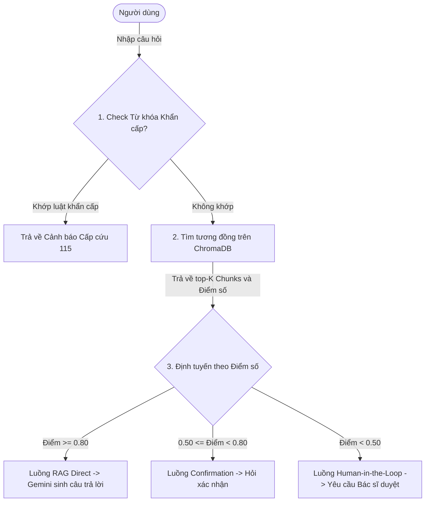
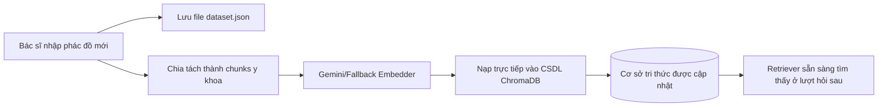

- **Thời gian cập nhật:** 14/06/2026
- **Sinh viên thực hiện:** Trần Đức Thịnh
- **Dự án:** Medical RAG Assistant (Hỏi đáp & Kiểm duyệt Phác đồ Điều trị Y khoa)

---

## I. Tổng quan dự án

Trong lĩnh vực y học lâm sàng, việc cung cấp thông tin phác đồ điều trị chính xác là vô cùng quan trọng. Các mô hình ngôn ngữ lớn (LLM) hiện nay, dù rất thông minh, vẫn gặp phải hiện tượng **ảo tưởng thông tin (hallucination)**, có thể dẫn đến việc đưa ra các lời khuyên y tế sai lệch gây nguy hiểm trực tiếp cho người bệnh.

Dự án **Medical RAG Assistant** được xây dựng nhằm giải quyết triệt để vấn đề này bằng cách tích hợp mô hình **RAG (Retrieval-Augmented Generation)** kết hợp với **Hệ chuyên gia (Expert System)** làm màng lọc kiểm duyệt an toàn, cùng cơ chế can thiệp của con người **(Human-in-the-Loop)** nhằm khép kín vòng lặp học hỏi dữ liệu **(Data Flywheel)**. Hệ thống cho phép người dùng hỏi đáp phác đồ điều trị, cảnh báo nguy kịch ngay lập tức mà không đi qua LLM nếu phát hiện triệu chứng nguy hiểm, và tự động học thêm các bệnh lý mới khi được bác sĩ trưởng khoa cung cấp dữ liệu đầu vào.

---

## II. Công nghệ sử dụng (Tech Stack)

Hệ thống được thiết kế theo cấu trúc mô-đun tinh gọn, tối ưu hiệu năng và hỗ trợ chạy offline dự phòng:
1.  **Framework & Ngôn ngữ chính:** **Python 3.12** - Sử dụng lập trình hướng đối tượng giúp đóng gói các thành phần nghiệp vụ riêng biệt.
2.  **Cơ sở dữ liệu Vector:** **ChromaDB** - Cơ sở dữ liệu vector gọn nhẹ được cấu hình chạy dưới dạng Persistent Client (lưu trữ bền vững xuống đĩa cứng tại `data/chroma_db/`) và sử dụng khoảng đo góc Cosine Similarity để so khớp tài liệu.
3.  **Vector Embeddings:** **Google Gemini API (`text-embedding-004`)** - Mô hình sinh vector nhúng 768 chiều chất lượng cao từ văn bản ngữ cảnh.
4.  **Mô hình ngôn ngữ lớn (LLM):** **Google Gemini API (`gemini-2.5-flash`)** - Sinh câu trả lời tự nhiên dựa trên ngữ cảnh y khoa được truy xuất.
5.  **Cơ chế dự phòng offline (Fallback Embedder):** Thuật toán tự băm ký tự (Character-hashing) kết hợp chuẩn hóa L2 (L2 Normalization) do hệ thống tự cài đặt từ đầu, giúp ứng dụng tự tạo vector 768 chiều khi không có kết nối internet hoặc thiếu API Key mà không bị lỗi hệ thống.
6.  **Thư viện hỗ trợ:**
    *   `pyyaml`: Đọc cấu hình dùng chung từ tệp `config.yaml`.
    *   `python-dotenv`: Quản lý các khóa bảo mật và biến môi trường cục bộ thông qua file `.env`.
    *   `colorama`: Hỗ trợ in màu sắc (ANSI escape codes) hiển thị kết quả trực quan trên Windows Terminal / PowerShell.

---

## III. Cấu trúc và chức năng chi tiết các Module dự án

Dự án được tổ chức theo cấu trúc dạng module chuẩn hóa như sau:

*   **`main.py`**: Bộ điều phối trung tâm (Orchestrator). Chịu trách nhiệm khởi tạo các module con, đọc cấu hình, nạp cơ sở dữ liệu ban đầu, định tuyến câu hỏi của người dùng và in ra màn hình đường đi suy diễn (Explanation Facility) của hệ chuyên gia.
*   **`config.yaml`**: Lưu trữ các đường dẫn thư mục lưu log, cơ sở dữ liệu vector, tệp tin cấu hình luật chuyên gia, tham số phân đoạn (chunk_size) và tên mô hình AI sử dụng.
*   **`config/expert_rules.json`**: Định nghĩa tập luật của hệ chuyên gia bao gồm các từ khóa nguy kịch cảnh báo cấp cứu (Emergency Keywords) và các ngưỡng tin cậy định tuyến (Confidence Thresholds).
*   **`data/dataset.json`**: Tệp tin JSON lưu trữ toàn bộ các phác đồ điều trị y tế gốc (gồm thông tin bệnh lý, triệu chứng, điều trị, dấu hiệu cảnh báo).
*   **`src/ingestion/loader.py` (Lớp `MedicalProtocolLoader`)**: Chịu trách nhiệm đọc tệp tin JSON và thực hiện tiền xử lý văn bản thô (chuyển sang chữ thường, dùng Regex lọc bỏ các ký tự đặc biệt để giữ lại ký tự chữ tiếng Việt sạch).
*   **`src/chunking/chunker.py` (Lớp `MedicalProtocolChunker`)**: Nhận dữ liệu thô và chia tách thành các khối văn bản (chunks) tự chứa ngữ cảnh cụ thể (Self-contained context), đính kèm siêu dữ liệu (Metadata) gồm: `chunk_id`, `disease_id`, `disease_name`, `info_type` (phân loại là triệu chứng, phác đồ điều trị, hay cảnh báo nguy hiểm).
*   **`src/embeddings/embedder.py` (Lớp `MedicalEmbedder`)**: Quản lý phiên gọi API sinh vector nhúng của Gemini. Tự động chuyển đổi sang cơ chế băm offline nếu kết nối mạng bị gián đoạn.
*   **`src/vectordb/vector_store.py` (Lớp `MedicalVectorStore`)**: Đóng gói các tương tác với ChromaDB. Xử lý việc nạp hàng loạt các vector chunks vào DB và truy vấn các vector tương tự theo thuật toán HNSW Cosine Space.
*   **`src/retrieval/retriever.py` (Lớp `MedicalRetriever`)**: Thực hiện lấy các đoạn văn bản tương đồng nhất từ DB vector, xếp hạng điểm số và gộp chúng lại thành chuỗi ngữ cảnh thống nhất (context string) để chuẩn bị đưa vào prompt.
*   **`src/llm/llm_client.py` (Lớp `GeminiLLMClient`)**: Thiết lập và duy trì kết nối tới API sinh văn bản của Gemini, hỗ trợ linh hoạt cả 2 phiên bản thư viện cũ (`google-generativeai`) và mới (`google-genai`).
*   **`src/utils/helpers.py`**: Các hàm tiện ích hỗ trợ đọc ghi file, log lỗi hệ thống, và khởi chạy thiết lập ban đầu.
*   **`src/download_dataset.py`**: Script độc lập sử dụng thư viện chuẩn của Python (`urllib`) để kết nối API Hugging Face tải dữ liệu y tế tiếng Việt và lưu trực tiếp vào dự án.

---

## IV. Vòng đời dữ liệu (Data Lifecycle)

Dữ liệu y khoa lâm sàng trong dự án được quản lý chặt chẽ xuyên suốt 4 giai đoạn của vòng đời:

### 1. Giai đoạn CREATE (Khởi tạo dữ liệu)
*   **Bước 1 (Tải dữ liệu ngoài):** Khi chạy tệp `download_dataset.py`, hệ thống kết nối trực tuyến tới Hugging Face kéo hàng trăm bản ghi cặp QA y tế thực tế, làm sạch thô và lưu trữ vật lý xuống file `data/dataset.json`.
*   **Bước 2 (Nạp dữ liệu vào CSDL Vector):** Khi ứng dụng `main.py` khởi chạy, nó kiểm tra số lượng bản ghi trong collection của ChromaDB. Nếu rỗng (`count == 0`), hệ thống sẽ nạp tệp `dataset.json` lên $\rightarrow$ chuyển qua module Chunker để phân đoạn $\rightarrow$ chuyển qua module Embedder biến đổi văn bản thành vector $\rightarrow$ lưu trữ toàn bộ vector kèm metadata vào thư mục cơ sở dữ liệu `data/chroma_db/`.

### 2. Giai đoạn USED (Truy xuất và Sử dụng dữ liệu)
Khi người dùng nhập một câu hỏi bất kỳ, dữ liệu được xử lý qua hai màng lọc chính:
1.  **Lọc từ khóa khẩn cấp (Hệ chuyên gia):** Câu hỏi được chuẩn hóa và tìm kiếm các từ khóa cấp cứu nguy kịch. Nếu trùng khớp, hệ thống chuyển thẳng thông báo cấp cứu mà không đi qua RAG/LLM.
2.  **Truy vấn ngữ nghĩa & Định tuyến:** Nếu là câu hỏi bình thường, câu hỏi được chuyển đổi thành vector nhúng và tìm kiếm trên ChromaDB để lấy ra các đoạn phác đồ tương đồng cùng khoảng cách (distance). Điểm tương đồng được tính theo công thức:
    $$\text{Similarity} = 1.0 - \text{Distance}$$
    Hệ chuyên gia so sánh điểm số này với các ngưỡng tin cậy để quyết định luồng đi tiếp theo (RAG Direct, RAG Confirmation, hoặc kích hoạt Human-in-the-Loop).

### 3. Giai đoạn UPDATE (Cập nhật dữ liệu - Data Flywheel)
*   Khi người dùng xác nhận nhập tri thức mới thông qua luồng **Human-in-the-Loop**:
    *   Hệ thống ghi đè thông tin phác đồ mới (tên bệnh, triệu chứng, điều trị, cảnh báo) vào cuối tệp tin `data/dataset.json` để lưu trữ lâu dài.
    *   Đồng thời, hệ thống cắt nhỏ phác đồ mới này thành các chunk ngữ cảnh cụ thể, chạy qua bộ tạo vector nhúng và đẩy trực tiếp các điểm vector mới này vào collection ChromaDB đang chạy. Bánh đà dữ liệu được khép kín mà không cần chạy lại quy trình lập chỉ mục từ đầu.

### 4. Giai đoạn DELETE (Xóa dữ liệu)
*   Trong trường hợp dữ liệu bị sai lệch hoặc cần tái cấu trúc CSDL Vector:
    *   Người dùng hoặc quản trị viên có thể xóa thư mục vật lý `data/chroma_db/` và khởi chạy lại ứng dụng.
    *   Hệ thống phát hiện collection trống và tự động chạy lại quy trình đồng bộ hóa để tạo lại toàn bộ chỉ mục vector từ tệp tin gốc `dataset.json`.

---

## V. Sơ đồ các luồng chính của hệ thống

### 1. Luồng chạy tổng quát (Overall Workflow)
Mô tả quy trình xử lý câu hỏi của người dùng thông qua màng lọc Hệ chuyên gia và RAG:

### 2. Luồng tự học khép kín (Data Flywheel Ingestion Loop)
Mô tả cách thức hệ thống tự cập nhật tri thức khi Bác sĩ duyệt và ghi nhận bệnh lý mới:

---

## VI. Đánh giá và Định hướng phát triển

### 1. Ưu điểm
*   Kiến trúc kết hợp Hệ chuyên gia và RAG giúp kiểm soát được đầu ra của mô hình ngôn ngữ lớn, giảm thiểu tối đa các rủi ro về ảo tưởng thông tin y khoa nguy hại.
*   Cơ chế Human-in-the-Loop và Data Flywheel giúp hệ thống có khả năng tự học thực tế và làm giàu cơ sở tri thức liên tục.
*   Hệ thống gọn nhẹ, dễ dàng cấu hình chạy ngoại tuyến (offline) nhờ thuật toán vector dự phòng mà không bị lỗi crash ứng dụng.

### 2. Định hướng nâng cấp tiếp theo
*   **Tích hợp Semantic Embeddings cục bộ:** Thay vì sử dụng Hashing Vectorizer thô sơ làm dự phòng offline, hệ thống có thể tích hợp các mô hình embedding tiếng Việt nhỏ chạy trực tiếp trên CPU (như PhoBERT hoặc các mô hình Sentence-Transformers tiếng Việt) để so khớp ngữ nghĩa offline chính xác hơn.
*   **Phân quyền chặt chẽ:** Xây dựng màn hình đăng nhập và xác thực (JWT Token). Chỉ những tài khoản bác sĩ đã qua kiểm duyệt chứng chỉ hành nghề mới được quyền phê duyệt và ghi đè phác đồ mới vào tệp `dataset.json`.
*   **Giao diện trực quan:** Đóng gói mã nguồn kết hợp API web của FastAPI và giao diện người dùng Web (UI Web) bằng Streamlit để bác sĩ có thể tương tác hỏi đáp và duyệt bệnh một cách dễ dàng và hiện đại hơn.
